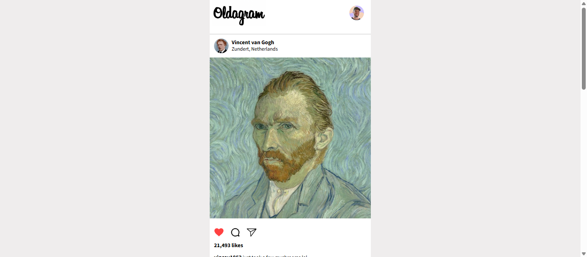

# Oldagram

## Description

This project is a browser-based social media feed inspired by Instagram. It displays posts with user information, images, captions, and like counts.

Users can like and unlike posts by clicking the like button. They can also double-click a post image to like it, with a heart pop animation providing visual feedback.

The project was built using HTML, CSS, and JavaScript, focusing on DOM manipulation, event listeners, CSS animations, and interactive UI updates.

This task was completed as part of the [Scrimba The Fullstack Developer Path](https://scrimba.com/c0fullstack).

---

### Screenshot

---

### Links

- Solution URL: [GitHub](https://github.com/artemkotko14/oldagram)
- Live Site URL: [Webpage](https://artemkotko14.github.io/oldagram/)

---

## Technologies Used

- HTML5
- CSS3
- Flexbox
- JavaScript
- DOM Manipulation
- CSS Animations

## Features

- Display social media posts dynamically using JavaScript
- Like and unlike posts
- Update like counts dynamically
- Double-click images to like posts
- Heart pop animation when liking a post
- Display user avatars, names, locations, images, and captions
- Responsive mobile-focused layout

## Future Improvements

- Add more posts and user interactions
- Add comments functionality
- Add a share button
- Add a save/bookmark feature
- Add a navigation menu
- Add a responsive desktop layout
- Add more animations and transitions
- Store likes using local storage
- Refactor JavaScript into smaller functions or modules

## Author

- GitHub - [Artem Kotko](https://github.com/artemkotko14)
